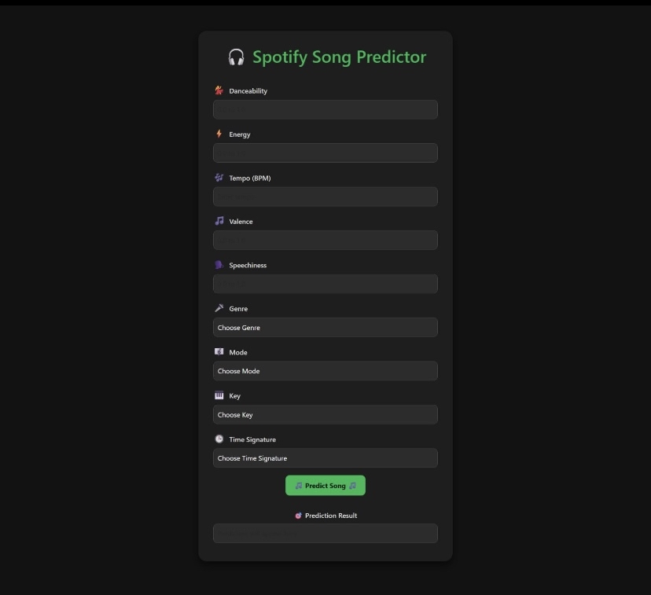
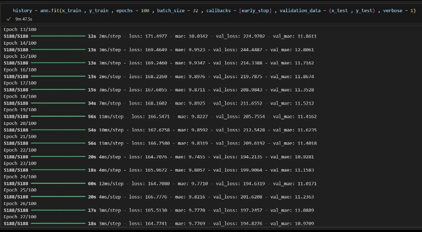
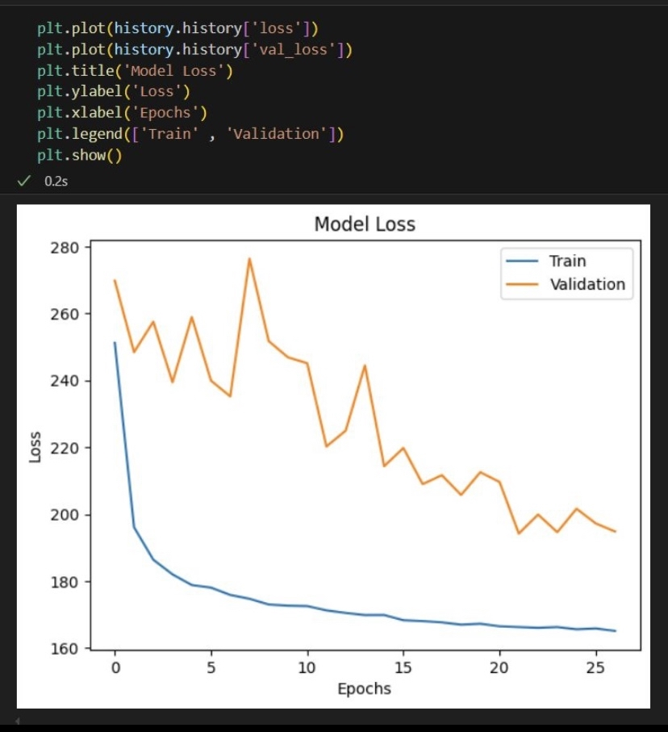

# 🎵 Spotify Song Popularity Prediction Using ANN

A **deep learning regression project** that predicts **song popularity scores** based on Spotify audio features using an **Artificial Neural Network (ANN)**.  
The model learns patterns from audio attributes to estimate how popular a song is likely to be.

---

## 🎯 Features

- 🧠 **ANN-based regression model** for popularity prediction  
- 🎼 Uses Spotify **audio features** as input  
- 🔧 Data preprocessing:
  - Encoding  
  - Scaling  
  - Normalization  
- 📈 Hyperparameter tuning for improved performance  
- 🧪 Interface to test songs and get popularity predictions  

---

## 🖼️ Visuals

### Home Page
📸 Interface to input song features and get popularity prediction  

### Training History
📸 Model training history showing epochs and loss values (`model.fit`)  

### Model Performance Graphs
📸 Training vs Validation **Loss & MAE** graph  

---

## 📊 Model Performance

- **Training MAE:** ~9.74  
- **Validation MAE:** ~10.92  
- **Loss:** 0.21  

---

## 🧠 Tech Stack

- **Language:** Python  
- **Deep Learning:** TensorFlow / Keras  
- **Model:** Artificial Neural Network (ANN)  
- **Data Processing:** Pandas, NumPy, Scikit-learn  
- **Visualization:** Matplotlib  

---

## 📚 Learning Outcomes

- Strong understanding of **regression using ANN**  
- Hands-on experience with **feature preprocessing**  
- Learned to evaluate models using **MAE & loss metrics**  
- Visualized training performance across epochs  
- Applied deep learning to a **real-world dataset (Spotify)**  

---

## 🚀 About

This project enhanced my understanding of **deep learning for regression problems** and motivated me to further improve model performance and explore advanced architectures.
